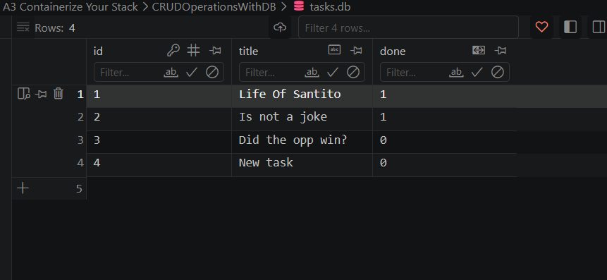

# Task CRUD API - Containerized with PostgreSQL

## Overview

Express.js CRUD API with PostgreSQL, fully containerized via Docker Compose. This project demonstrates a production-ready stack with proper secret management, database persistence, and one-command deployment.

## One-Command Startup

```bash
cp .env.example .env
docker compose up
```

- API: http://localhost:3000/tasks
- Swagger UI: http://localhost:3000/docs

## Environment Variables

See `.env.example` for required variables:

| Variable | Description | Default |
|----------|-------------|---------|
| `DATABASE_URL` | PostgreSQL connection string | `postgres://postgres:dev@db:5432/tasks` |
| `PORT` | Server port | `3000` |

**Security**: `.env` is git-ignored. Never commit real credentials.

## API Endpoints

| Method | Endpoint | Description | Success Code |
|--------|----------|-------------|--------------|
| GET | `/tasks` | List all tasks | 200 |
| GET | `/tasks/:id` | Get single task | 200 / 404 |
| POST | `/tasks` | Create task | 201 |
| PUT | `/tasks/:id` | Update task | 200 / 404 |
| DELETE | `/tasks/:id` | Delete task | 204 / 404 |
| GET | `/docs` | Swagger UI documentation | 200 |

### Request/Response Examples

**Create a task:**
```bash
curl -i -X POST http://localhost:3000/tasks \
  -H "Content-Type: application/json" \
  -d '{"title": "New task"}'
```

**Response:**
```
HTTP/1.1 201 Created
X-Powered-By: Express
Content-Type: application/json; charset=utf-8
Content-Length: 65

{"success":true,"dataInserted":{"id":6,"title":"New task","done":false}}
```

**Get all tasks:**
```bash
curl -i http://localhost:3000/tasks
```

**Response:**
```
HTTP/1.1 200 OK
X-Powered-By: Express
Content-Type: application/json; charset=utf-8
Content-Length: 214

{"success":true,"count":3,"data":[{"id":1,"title":"Life Of Santito","done":true},{"id":2,"title":"Is not a joke","done":true},{"id":3,"title":"Did the opp win","done":false}]}
```

**Update a task:**
```bash
curl -i -X PUT http://localhost:3000/tasks/1 \
  -H "Content-Type: application/json" \
  -d '{"title": "Updated title", "done": true}'
```

**Delete a task:**
```bash
curl -i -X DELETE http://localhost:3000/tasks/1
```

## Database Screenshot

```bash
# View database directly
docker exec -it a3containerizeyourstack-db-1 psql -U postgres -d tasks
```

```sql
tasks=# \dt
         List of relations
 Schema | Name  | Type  |  Owner
--------+-------+-------+----------
 public | tasks | table | postgres
(1 row)

tasks=# SELECT * FROM tasks;
 id |       title       | done
----+-------------------+------
  1 | Life Of Santito   | t
  2 | Is not a joke     | t
  3 | Did the opp win   | f
(3 rows)
```


## Verification - Clean Clone Test

```bash
# 1. Clone repository
git clone https://github.com/yba-santito/FlyRankAIBackEndPath.git
cd <repo-name>

# 2. Configure environment
cp .env.example .env

# 3. Start entire stack
docker compose up

# 4. Verify API works
curl http://localhost:3000/tasks
# Returns 3 seeded tasks in under 5 minutes with no manual database setup
```

## Architecture

```
┌─────────────────────────────────────────────┐
│              Docker Host                    │
│  ┌─────────────────────────────────────┐   │
│  │          docker-compose.yml         │   │
│  │  ┌──────────┐    ┌──────────────┐  │   │
│  │  │   api    │───▶│      db      │  │   │
│  │  │  :3000   │    │  postgres    │  │   │
│  │  │  Node.js │    │  :5432       │  │   │
│  │  └──────────┘    │  volume      │  │   │
│  │                  │  taskdata    │  │   │
│  │                  └──────────────┘  │   │
│  └─────────────────────────────────────┘   │
└─────────────────────────────────────────────┘
```

- **api**: Node.js Express application (multi-stage Dockerfile, non-root user)
- **db**: PostgreSQL 16 with named volume `taskdata` for persistence
- **Network**: Internal compose network, `api` reaches `db` via service name
- **Secrets**: `DATABASE_URL` from `.env` (git-ignored), `.env.example` committed

## Development

```bash
# Local development (no Docker)
npm install
npm start
# Runs on port 3333 with SQLite (legacy)

# Container development
docker compose up
# Runs on port 3000 with PostgreSQL
```

## Project Structure

```
.
├── Dockerfile                 # Multi-stage Node.js build
├── compose.yaml              # Two-service stack (api + db)
├── .env.example              # Environment template (committed)
├── .gitignore                # Ignores .env, node_modules, tasks.db
├── package.json
├── CRUDOperationsWithDB/
│   ├── SetUp.js             # Express server + routes
│   ├── swagger.json         # OpenAPI 3.0 spec
│   └── db/
│       ├── connection.js    # pg.Pool wrapper
│       └── taskRepository.js # Parameterized queries ($1, $2...)
└── README.md
```

## Key Implementation Details

- **Parameterized queries**: All SQL uses `$1, $2` placeholders (no string interpolation)
- **Seed-once logic**: 3 tasks inserted only when `tasks` table is created
- **Dependency injection**: `DatabaseConnection` → `TaskRepository` → Routes
- **Error handling**: Consistent 400/404/500 responses with JSON error messages
- **Health check**: `pg_isready` ensures db is ready before api starts

## Dependencies

```json
{
  "express": "^4.18.2",
  "pg": "^8.11.0",
  "swagger-ui-express": "^5.0.0",
  "dotenv": "^16.3.0"
}
```

## Screenshot of database


## License

ISC